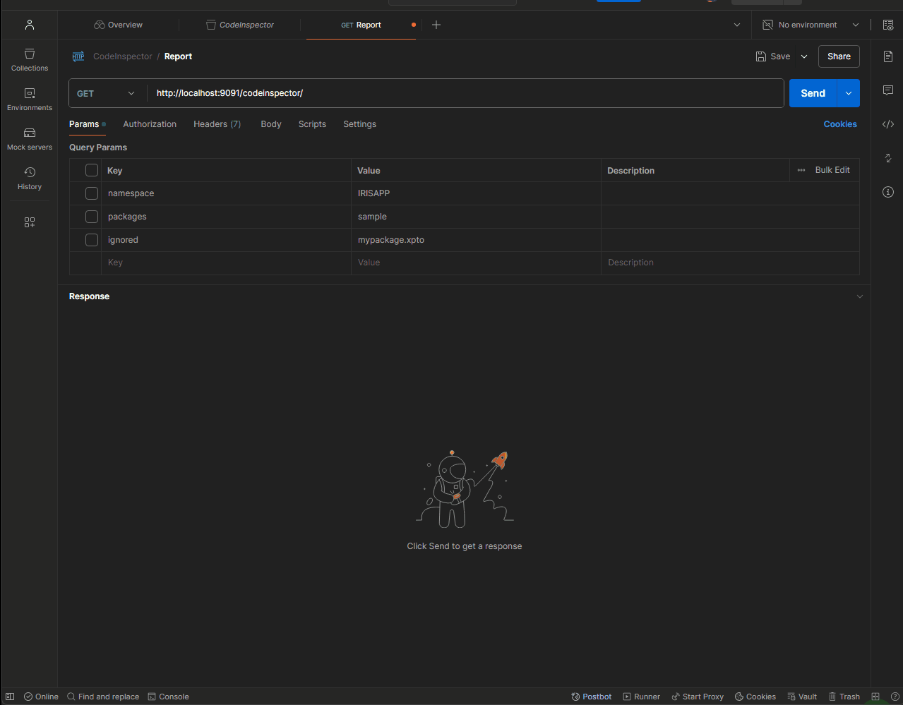
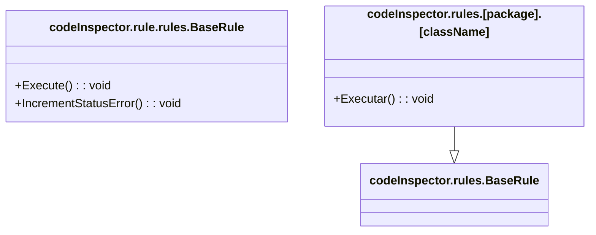

# iris-dev-codeinspector

The **CodeInspector** program validates packages and classes based on predefined rules. It processes the provided packages, identifies associated classes, and applies validations while ignoring specified packages and classes. The results can be displayed in the console or returned as structured JSON.

## Contributors

- **Rodolfo Moreira** - Shift Consultoria e Sistemas Ltda ([www.shift.com.br](http://www.shift.com.br))

## Inspiration

The motivation behind **CodeInspector** is to create a tool that is easy to implement, allowing teams to define their own rules and adapt the tool to their business needs. By offering flexibility and simplicity, teams can ensure code quality while addressing specific requirements within their development process.

## Challenges Faced
The Shift team is developing our own tools, as we haven't found any that fit our specific business needs. To address this demand, I created a tool that is flexible and easy to implement, allowing any team member to create new rules without complications.

## Features

- Analyzes and validates packages and classes based on predefined rules.
- Processes specified packages and identifies relevant classes.
- Applies custom validations while excluding marked packages and classes.
- Generates detailed error reports, viewable in the console or as structured JSON.

## Getting Started

### Installation with Docker

#### Prerequisites

Ensure you have the following installed:

- [Git](https://git-scm.com/book/en/v2/Getting-Started-Installing-Git)
- [Docker Desktop](https://www.docker.com/products/docker-desktop)

#### Clone the Repository

Clone or pull the repository into a local directory:

```bash
$ git clone git@github.com:rodoctor/iris-dev-codeinspector.git
```

Navigate to the directory and run:

```bash
$ docker-compose up -d
```

## IPM
Open IRIS installation with IPM client installed:
```bash
USER>zpm "load /home/irisowner/dev"
```

## Management portal: 

The management portal is available at: 
[Management portal](http://localhost:9091/csp/sys/UtilHome.csp)


## Rest API - CodeInspector Repost

### API Parameters

The API is available at [http://localhost:9091/codeinspector/](http://localhost:9091/codeinspector/) and accepts the following parameters:

- **namespace**: *(required)* The namespace specifies the context in which the validation will be executed.
- **packages**: *(required)* This parameter must include the names of the packages to be analyzed. Multiple package names can be provided, separated by commas.
- **ignored**: This parameter allows you to specify a list of package names that should be excluded from the validation process. Multiple names should also be separated by commas.

### Postman export
You can find an export of the Postman Collection for testing the available API in the `collectionPostman` folder of this project.
Import  into Postman to run tests.




## Creating New Rules



- The new rule must extend the framework.codeInspector.rules.BaseRule class.
- The new rule should override the Execute() method.
- The method receives three parameters:
    - pMethodContent - Stream containing the content of the method to be validated.
    - pIdMethod - A combination of the class name and the method name that represents the content of the stream.
    - ByRef pArrayErrors - Holds all the statuses from previous validations. If necessary to increment, the method IncrementStatusError() should be used.
- The IncrementStatusError method should be implemented as shown in the example below:

```objectscript
Set type = "Interdependency"
Set errorDescription = "A call to a BusinessOperation has been found within another BusinessOperation."
Do ..IncrementStatusError(.pArrayErrors,pIdMethod,type,pMethodContent,errorDescription)
```

## Built with
- WSL Ubuntu 22.04
- VSCode
- Package of ObjectScript plugin
- IRIS for Health Community Edition in Docker

## Collaboration 
We welcome any and all contributions! Feel free to fork the repository, make improvements or suggest changes, and submit a Pull Request. Every contribution is appreciated, and we look forward to collaborating with you.
